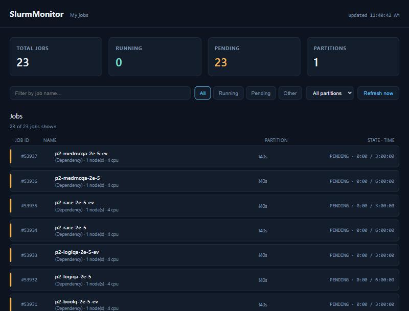

# SlurmMonitor

A small, self-hosted, live job dashboard for a SLURM cluster. One FastAPI
backend polls `squeue -u $USER` over SSH and serves a dark-themed dashboard
(styled after FrostLine's webui: colored status stripes, stat cards) showing
**your own** queued and running jobs — nobody else's.




## Features

- **Live**: backend re-polls SSH every 20s (configurable); frontend re-polls
  the API every 10s; a "Refresh now" button forces an immediate poll.
- **Scoped to you**: `squeue -u $USER` — `$USER` is expanded on the *remote*
  side by whichever SSH identity connected, so each person who runs this
  only ever sees their own jobs, never a hardcoded username.
- **Filters**: free-text search by job name, state filter (Running / Pending
  / Other), and a partition dropdown, all client-side and instant.
- **At a glance**: total jobs, running count, pending count, and how many
  partitions you currently have jobs in.
- **Reverse-proxy friendly**: the page detects its own mount path at
  runtime (via `window.location.pathname`) so it works whether it's served
  at `/` or behind a path prefix like `/slurm` (e.g. Tailscale Serve).
- **No history**: this is a live queue snapshot (`squeue`), not job
  accounting (`sacct`) — once a job leaves the queue, it drops off here.

## Architecture

```
┌─────────────┐   SSH (squeue -u $USER)   ┌──────────────────┐
│  Cluster     │ <──────────────────────  │  backend/main.py │
│  login node  │                          │  (FastAPI)       │
└─────────────┘                          │  poll every 20s,  │
                                          │  cache in memory  │
                                          └────────┬──────────┘
                                                    │ /api/jobs (JSON)
                                                    ▼
                                          ┌──────────────────┐
                                          │  static frontend  │
                                          │  (vanilla JS,      │
                                          │  polls every 10s)  │
                                          └──────────────────┘
```

Everything runs in a single Docker container. There's no database — the
backend just holds the last poll's result in memory and re-fetches it on a
timer; restarting the container just means one missed refresh cycle.

## Project structure

```
SlurmMonitor/
├── backend/
│   ├── main.py              FastAPI app: SSH polling, /api/* endpoints
│   └── static/
│       ├── index.html       Single-page dashboard shell
│       ├── app.js           Fetch/render/filter logic
│       └── style.css        Dark theme (FrostLine-inspired)
├── Dockerfile                python:3.12-slim + openssh-client
├── docker-compose.yml         port mapping + SSH dir mount + env
├── entrypoint.sh              copies/chmods the mounted SSH dir, then boots uvicorn
├── .env.example                template for your own local config
└── .env                        your actual config (gitignored, never committed)
```

## API reference

| Endpoint | Method | Returns |
|---|---|---|
| `/` | GET | The dashboard HTML |
| `/api/jobs` | GET | `{ generated_at, host, jobs: [...], error }` — the cached snapshot |
| `/api/refresh` | POST | Forces an immediate SSH poll, then returns the same shape as `/api/jobs` |
| `/api/stats` | GET | Aggregate counts: totals, by state, by partition, top users |

Each job object: `job_id`, `name`, `user`, `state`, `time_used`,
`time_limit`, `nodes`, `partition`, `reason` (nodelist when running, queue
reason when pending), `cpus`.

## Run it

```bash
cp .env.example .env   # then edit SSH_DIR / SLURM_SSH_HOST for your setup
docker compose up -d --build
```

Then open **http://localhost:8091** (or whatever `HOST_PORT` you set).

## Configuration (`.env`)

| Variable | Meaning |
|---|---|
| `SSH_DIR` | Your own SSH directory (config, key, known_hosts), mounted read-only |
| `HOST_PORT` | Port exposed on the host |
| `SLURM_SSH_HOST` | SSH alias/host to run `squeue` on |
| `REFRESH_INTERVAL_SECONDS` | How often the backend re-polls SSH |

## Set up on a new machine (e.g. handing this to a colleague)

This project is safe to hand off as-is: `.env` is gitignored and nothing in
the repo contains a key, password, or a specific username. Each person's
copy reads their own cluster jobs.

1. Get the code (clone this repo).
2. **Never send or copy someone else's private SSH key.** You need your own
   working, passwordless (or agent-backed) SSH access to the cluster first
   — test it from a normal terminal: `ssh <your-alias-or-host> squeue -u $USER`.
   If that prompts for a password, this app can't authenticate non-interactively
   either; fix that first (e.g. install a key with `ssh-copy-id` and no
   passphrase, or use `ssh-agent`).
3. `cp .env.example .env`, then edit `.env`:
   - `SSH_DIR` → the absolute path to *your* `~/.ssh` directory.
   - `SLURM_SSH_HOST` → the host/alias from step 2.
4. `docker compose up -d --build`, then open `http://localhost:8091`
   (or your `HOST_PORT`).

## Design notes

**Why the SSH dir is copied, not mounted straight into `/root/.ssh`.**
A Windows bind mount can't carry Unix file permissions, and `ssh` refuses
keys/config that look world-readable. `entrypoint.sh` copies the mounted
`/ssh-host` into `/root/.ssh` on container start and `chmod`s everything
correctly, and starts a fresh `cm/` (ControlMaster socket dir) each time so
a stale multiplexed connection from a host-side session can never break it.
Each poll also explicitly disables SSH multiplexing (`ControlMaster=no`) so
one bad connection can't wedge every subsequent poll.

**Why polling, not push.** SLURM has no built-in webhook/event stream for
job state changes, so periodic `squeue` polling is the standard way to
observe queue state — the same approach `sacct`/`squeue`-based dashboards
generally use.

## Troubleshooting

- **`error: ssh to <host> timed out` / permission denied** — test the exact
  same command manually first: `ssh -o BatchMode=yes <host> squeue -u $USER`.
  `BatchMode=yes` fails immediately instead of prompting, which is exactly
  what the container does — if it hangs or asks for a password on your
  machine, fix that before it'll work in Docker.
- **Container starts but jobs never appear** — check `docker logs
  slurmmonitor` for the SSH error message; the `/api/jobs` endpoint also
  surfaces the last error in its `error` field.
- **Port already in use** — change `HOST_PORT` in `.env` and re-run
  `docker compose up -d --build`.

## Viewing it as a local hostname (e.g. `slurmMonitor.local`)

Add a hosts-file entry yourself (this edits a system file, so it's not
automated here) — on Windows, from an **Administrator** PowerShell:

```powershell
Add-Content -Path C:\Windows\System32\drivers\etc\hosts -Value "`n127.0.0.1 slurmMonitor.local"
```

Then open `http://slurmMonitor.local:8091` (or your `HOST_PORT`).
